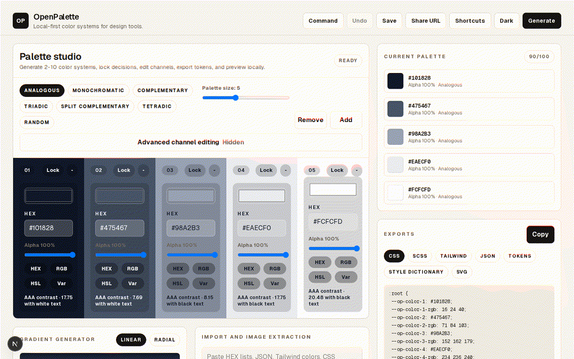

<div align="center">
  <br />

  <h1>OpenPalette</h1>
  <p>
    <em>A local-first, open-source color studio.</em>
  </p>

  <p>
    A palette machine for designers and developers. Generate harmonies, edit channels, extract from images, preview surfaces, validate accessibility, and export tokens — all in your browser.
  </p>

  <p>
    <strong>Brand accent:</strong> <code>#ff66c4</code> · Dark & light mode · Zero tracking
  </p>

  <p>
    <strong>Version:</strong> v0.9.4 (Release Candidate) · <a href="https://palette.kovina.org"><strong>palette.kovina.org</strong></a>
  </p>

  <p>
    <a href="https://github.com/sparshsam/openpalette/releases/latest"></a>
    <a href="LICENSE"></a>
    <a href="https://github.com/sparshsam/openpalette/actions/workflows/ci.yml"></a>
    
    
    
    
  </p>

  <p>
    <a href="#quick-links"><strong>Quick Links</strong></a>
    &nbsp;&nbsp;·&nbsp;&nbsp;
    <a href="#features"><strong>Features</strong></a>
    &nbsp;&nbsp;·&nbsp;&nbsp;
    <a href="#screenshots"><strong>Screenshots</strong></a>
    &nbsp;&nbsp;·&nbsp;&nbsp;
    <a href="#quick-start"><strong>Quick Start</strong></a>
    &nbsp;&nbsp;·&nbsp;&nbsp;
    <a href="#architecture"><strong>Architecture</strong></a>
    &nbsp;&nbsp;·&nbsp;&nbsp;
    <a href="#performance-and-testing"><strong>Performance</strong></a>
    &nbsp;&nbsp;·&nbsp;&nbsp;
    <a href="#tech-stack"><strong>Tech Stack</strong></a>
    &nbsp;&nbsp;·&nbsp;&nbsp;
    <a href="#roadmap"><strong>Roadmap</strong></a>
    &nbsp;&nbsp;·&nbsp;&nbsp;
    <a href="#license"><strong>License</strong></a>
  </p>

  <br />
</div>

---

## Quick Links

- [Live demo](https://palette.kovina.org)
- [Architecture](docs/architecture.md)
- [Design System](docs/design-system.md)
- [Product Spec](docs/product-spec.md)
- [Performance Notes](docs/performance.md)
- [Testing](docs/testing.md)
- [Roadmap](ROADMAP.md)
- [Changelog](CHANGELOG.md)
- [Contributing](CONTRIBUTING.md)

## Overview

OpenPalette is a practical color platform for designers, developers, and builders who want fast palette exploration without accounts, tracking, or cloud dependency.

The app is intentionally local-first. Palettes, collections, history, imports, exports, gradients, and image extraction run in the browser and persist with `localStorage`.

It is also intentionally original. OpenPalette does not copy Coolors branding, assets, product language, or visual identity.

## Features

| Feature | Status |
|---|---|
| Shared global workspace — all tools use one palette | Shipped |
| 2-10 color palette generator | Shipped |
| Harmony modes: analogous, monochromatic, complementary, triadic, split, tetradic, random | Shipped |
| Undo/redo (50 deep) | Shipped |
| HEX, RGB, HSL, alpha editing | Shipped |
| 75 curated explore palettes | Shipped |
| Image color extraction (6 modes) | Shipped |
| WCAG contrast checker (AA/AAA) | Shipped |
| Accessibility studio with 5-mode color blindness sim | Shipped |
| Palette health score (0-100) with recommendations | Shipped |
| Visual analytics: hue/saturation/lightness distributions | Shipped |
| Palette compare mode | Shipped |
| Workspace snapshots (save/restore/rename/delete) | Shipped |
| Gradient studio (linear/radial/conic) | Shipped |
| Design token scale generator | Shipped |
| Design system preview (buttons, cards, forms, alerts, etc.) | Shipped |
| Semantic token export (12 UI roles) | Shipped |
| Export formats: CSS, SCSS, Tailwind v4, JSON, W3C Design Tokens, Style Dictionary, Figma Variables, Flutter, React Native, Android XML, iOS Swift | Shipped |
| 7 naming presets: Tailwind, Material, Bootstrap, Fluent, Apple, OpenPalette, Custom | Shipped |
| Import design token JSON | Shipped |
| 150-color reference library with rich names | Shipped |
| 7 visualizer templates (website, mobile, dashboard, brand, etc.) | Shipped |
| Command palette with quick actions | Shipped |
| Keyboard shortcuts panel (`?` key) | Shipped |
| Settings page with import/export preferences | Shipped |
| Light/dark mode | Shipped |
| localStorage persistence | Shipped |
| Shareable URL state (no backend) | Shipped |
| Responsive: mobile through ultrawide | Shipped |
| PWA metadata | Shipped |
| GitHub Actions CI | Shipped |

## Screenshots

Real screenshots are committed in `assets/screenshots/` for the platform studio.

```
assets/screenshots/
├── studio.png       # Main palette studio
├── visualizer.png   # Visualizer and accessibility panels
└── mobile.png       # Responsive mobile layout

assets/demos/
└── openpalette-refinement.gif
```

## Feature Comparison

| Capability | OpenPalette | Cloud-first palette tools |
|---|---:|---:|
| Works without an account | Yes | Sometimes |
| Local palette persistence | Yes | Rarely |
| No telemetry by design | Yes | Varies |
| Shareable URLs without a backend | Yes | Usually backend-backed |
| Design-token exports | Yes | Often paid or limited |
| Image extraction in-browser | Yes | Varies |
| Open-source architecture | Yes | Usually no |

## Feature Showcase



- Calm palette studio with core controls first and advanced RGB/HSL editing collapsed by default.
- Local design-token preview for semantic color roles, spacing, typography, and radii.
- Focused engines for palette, accessibility, gradient, import, export, library, and image extraction behavior.
- Coverage-backed reliability for the color platform internals.

## Tech Stack

| Layer | Choice |
|-------|--------|
| Framework | [Next.js 16](https://nextjs.org) (App Router) |
| Language | [TypeScript](https://www.typescriptlang.org) (strict mode) |
| Styling | [Tailwind CSS v4](https://tailwindcss.com) |
| State | React client-state + localStorage |
| Deployment | [Vercel](https://vercel.com) + [Cloudflare](https://cloudflare.com) → [palette.kovina.org](https://palette.kovina.org) |
| Runtime | Node.js >= 22 |

## Getting Started

```bash
# Navigate to the repo
cd ~/repos/sparshsam/openpalette

# Install dependencies
npm install

# Development server
npm run dev

# Production build
npm run build

# Validation
npm run lint
npm run typecheck
npm run test:coverage
```

## Repository Structure

```
openpalette/
├── .github/workflows/
│   └── ci.yml              # Lint, typecheck, build
├── assets/
│   ├── screenshots/         # Product screenshots (TBD)
│   └── diagrams/            # Architecture diagrams (TBD)
├── docs/
│   ├── architecture.md      # Application architecture
│   ├── design-system.md     # Design tokens and UI patterns
│   ├── product-spec.md      # Product requirements
│   └── README.md            # Documentation index
├── src/
│   ├── app/                 # Next.js App Router pages
│   ├── components/          # React components
│   └── lib/                 # Utilities and color math
├── public/                  # Static assets
├── AGENTS.md                # AI agent instructions
├── CHANGELOG.md             # Keep a Changelog format
├── CLAUDE.md                # Claude Code instructions
├── CODE_OF_CONDUCT.md       # Professional conduct standards
├── CONTRIBUTING.md          # Contributor guide
├── LICENSE                  # MIT
├── README.md                # This file
├── ROADMAP.md               # Product roadmap
├── SECURITY.md              # Security policy
└── SUPPORT.md               # Support channels
```

## Architecture

OpenPalette is a single-page application with client-side state management:

- **Generation:** Color harmonies are computed in-browser using HSL color math and lock-aware replacement.
- **Locking:** Individual colors can be locked to preserve them during regeneration.
- **Persistence:** Current palette, library, tags, favorites, and history are stored in localStorage — no backend.
- **Exports:** CSS, SCSS, Tailwind, JSON, SVG, PNG, PDF, and design-token formats are generated client-side.
- **Extraction:** Image colors are sampled with browser canvas APIs and never leave the device.

See [docs/architecture.md](docs/architecture.md) for the full architecture document.

## Performance and Testing

The product refinement pass split the platform into focused engines, added deferred library filtering, collapsed advanced controls by default, and introduced Vitest coverage.

Current validation:

- `npm run lint`
- `npm run typecheck`
- `npm run test:coverage`
- `npm run build`

Coverage from the local refinement run:

- 13 tests across 4 files
- 89.32% statements
- 89.65% lines
- 93.02% functions
- 66.22% branches

See [docs/performance.md](docs/performance.md) and [docs/testing.md](docs/testing.md).

## Limitations

- **Local-first.** Palettes are stored in browser localStorage. Clearing browser data will lose unsaved palettes.
- **No accounts.** No cloud sync, no sharing, no collaborative features.
- **localStorage limit.** Large libraries may eventually need the planned IndexedDB migration layer.
- **ASE binary import.** Text exports containing HEX values import today; native binary ASE parsing remains a future parser.
- **PDF export.** The current palette sheet is intentionally lightweight and dependency-free.

## Ecosystem Role

OpenPalette is a **local-first design-tool** in the Sparsh Sam ecosystem. It fills the role of lightweight, browser-native color infrastructure — complementary to:

- **Chess by Sparsh** — local-first casual gaming (color palette inspiration for UI themes).
- **OpenScrabble** — local-first word gaming (shares the local-first, no-account design philosophy).

All three repos demonstrate a commitment to privacy-respecting, open-source tooling that runs entirely in the browser without backends, accounts, or telemetry.

## Workflow

1. Branch from `main`: `feat/description`, `fix/description`, `docs/description`
2. Run validation before every PR: `npm run lint && npm run typecheck && npm run build`
3. Open a pull request for every merge into `main`
4. No direct pushes to `main`

## Roadmap

See [ROADMAP.md](ROADMAP.md) for the full product roadmap.

## License

MIT — see [LICENSE](LICENSE).

---

*Last updated: June 2026*
