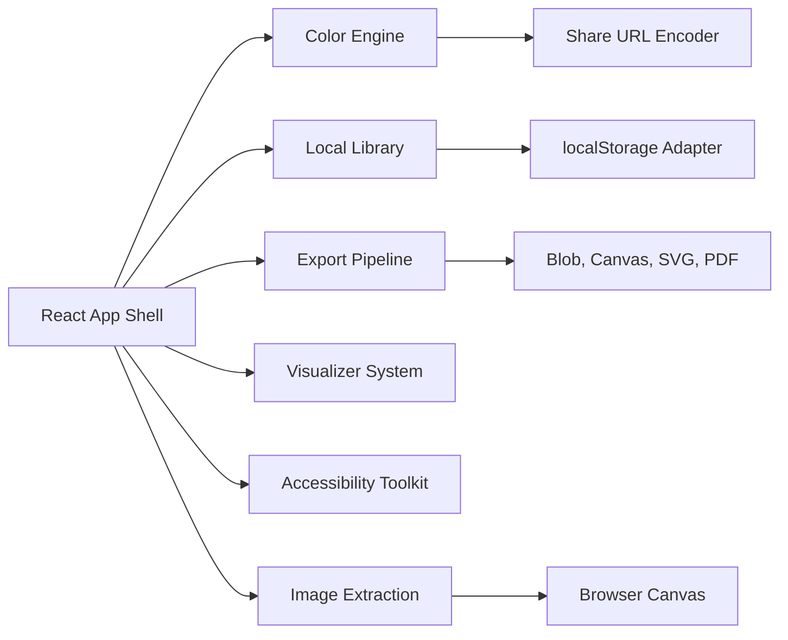

# OpenPalette Architecture

OpenPalette is a local-first Next.js App Router application. The static route shell loads quickly, then the full product runs in the browser with React state, localStorage, Clipboard, Blob, Canvas, and URL APIs.



## Stack

- Next.js 16 App Router
- React 19
- TypeScript strict mode
- Tailwind CSS v4
- ESLint
- localStorage persistence

## File Map

| Path | Purpose |
|---|---|
| `src/app/layout.tsx` | Root metadata, font loading, and app shell |
| `src/app/page.tsx` | Server component route entry |
| `src/components/openpalette-app.tsx` | Client-side studio orchestration and local state |
| `src/components/studio/visualizers.tsx` | Realistic palette application previews |
| `src/lib/palette.ts` | Public barrel for palette engines |
| `src/lib/palette/*-engine.ts` | Focused palette, accessibility, gradient, import, export, library, and image extraction engines |
| `src/lib/browser-exports.ts` | Browser-only PDF, PNG, and token preview helpers |
| `src/app/globals.css` | Tailwind import, theme tokens, and shared UI primitives |

## Client Boundary

`src/app/page.tsx` remains a small server component. Browser APIs such as `localStorage`, `navigator.clipboard`, `crypto.randomUUID`, keyboard listeners, `createImageBitmap`, Canvas, Blob downloads, and theme mutation live inside `OpenPaletteApp`.

## State Model

```text
PaletteColor
  id: string
  hex: string
  alpha: number
  locked: boolean

PaletteRecord
  id: string
  name: string
  colors: string[]
  alphas: number[]
  mode: PaletteMode
  tags: string[]
  collection: string
  favorite: boolean
  createdAt: string
  updatedAt: string
  usedAt: string
```

## Persistence

All persistence is local to the browser:

- active palette: `openpalette.current.v1`
- library records: `openpalette.library.v1`
- history records: `openpalette.history.v1`
- theme: `openpalette.theme`
- shared URL state: `?palette=...`

The record-based storage shape is ready for a future IndexedDB adapter without changing the UI ownership model.

## Feature Ownership

| Feature | Owner |
|---|---|
| Harmony modes and lock-aware generation | `src/lib/palette.ts` |
| Dynamic 2-10 color model | `src/lib/palette.ts` + `src/components/openpalette-app.tsx` |
| HEX, RGB, HSL, alpha editing | `src/lib/palette.ts` + swatch editors |
| Imports and share URLs | `src/lib/palette.ts` |
| CSS, SCSS, Tailwind, JSON, token, SVG snippets | `src/lib/palette.ts` |
| PNG and PDF downloads | `src/lib/browser-exports.ts` |
| Gradient system | `src/lib/palette/gradient-engine.ts` |
| Accessibility toolkit | `src/lib/palette.ts` + accessibility panel |
| Visualizer system | `src/components/studio/visualizers.tsx` |
| Image extraction | `src/lib/palette/image-extraction-engine.ts` |

## Build and Release Checks

```bash
npm run lint
npm run typecheck
npm run test:coverage
npm run build
```

CI runs the same checks on pushes and pull requests to `main`.
